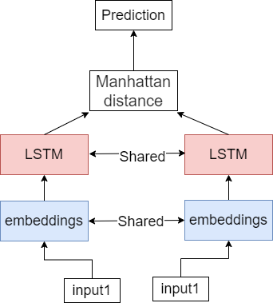
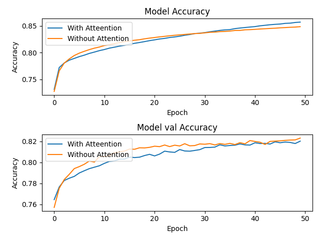
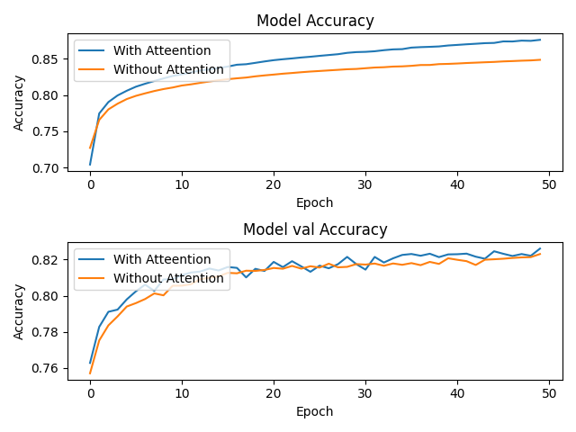
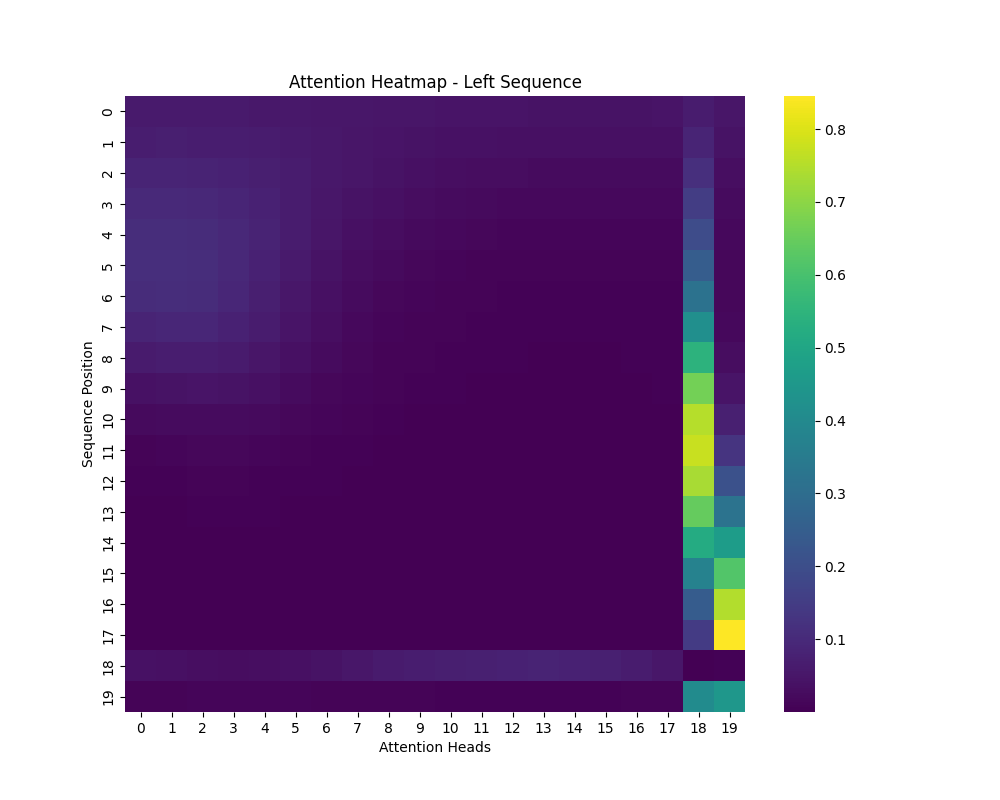
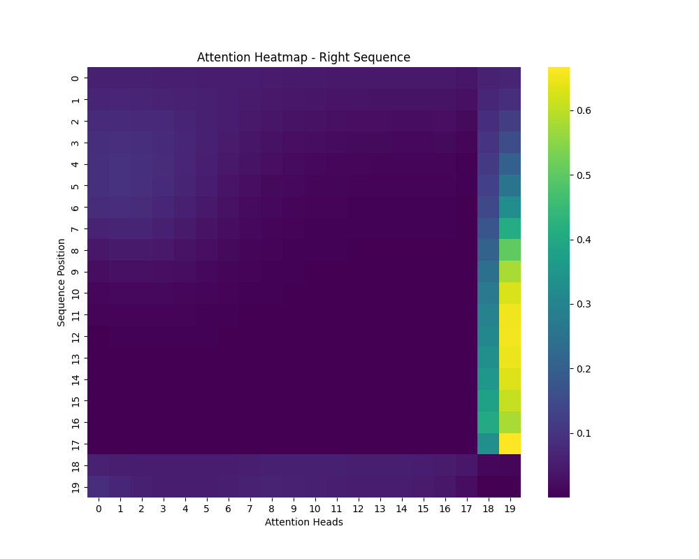

# README
## References
1. MUELLER, Jonas et THYAGARAJAN, Aditya. Siamese recurrent architectures for learning sentence similarity. In : Proceedings of the AAAI conference on artificial intelligence. 2016.
## 1. Introduction
Dans cet exercice, réseau siamois dans une tâche de "text-similarity" sur la dataset Quora est exploré. L'architecture de base proposée est un siamois à base de LSTM et la distance Manhatten inspiré de l'étude menée par [1]. Dans cette étude, le modèle siamois de base est entrainé sur la tache de similarité entre des pairs de questions du dataset Quora. Ensuite, l'impact de l'ajout du méchanisme d'attention (avant et après la couche LSTM) est étudié sur les performances du réseau à trouver des similarité des questions. En fin, les couches d'embedding sont remplacé par des embedding du modèle Bert, et une étude sur l'impact de l'ajout de cet LLM sur les performances est menée.

## 2. Siamese LSTM
 
Le réseau siamois de base est constitué de LSTM (Long Short-Term Memory) pour évaluer la similarité sémantique entre phrases. Ce modèle exploite des vecteurs d'embeddings de mots enrichis d'informations synonymiques pour capturer le sens profond des phrases. En calculant une métrique de Manhattan, le modèle oblige les représentations des phrases à former un espace  structuré, donnant des relations sémantiques complexes. 

### Architecture du Siamese LSTM

  

<em>Figure 1: Architecture du Siamese LSTM</em>

## 3. Attention + Siamese LSTM
Un mechanisme de self attention est ajouté après(ou avant) la couche LSTM. Les courbes suivantes montre une comparaison entre les performances en accuracy du moèle avec couche d'attention (avant et après LSTM) et sans attention.

  

<em>Figure 2: Accuracy pour les modèles avec attention avant LSTM et sans attention</em>

  

<em>Figure 3: Accuracy pour les modèles avec attention avant LSTM et sans attention</em>

La couche d'attention placée après la couche LSTM, augmente les performances en accuracy d'entrainement de manière significative. Le modèle apprend plus vite les similarités entre pair. L'accuracy de validation est un meilleur d'un degrée moins significatif que dans l'entrainement. 
Pour expliquer le résultat obtenu, il est constaté que la LSTM a déjà capturé l'information de toute la séquence, y compris les dépendances à long terme. L'attention peut donc se baser sur des représentations plus riches pour choisir les parties importantes.
La couche d'attention placée avant la couche LSTM n'améliore pas les performances du modèle, la LSTM n'a pas encore vu la séquence complète, donc l'attention est basée uniquement sur les informations locales, ce qui provoque une perte du contexte globale.

Les poids d'attention peuvent être visualisé dans les figures suivantes. La valeur à la position (𝑖,𝑗) dans la matrice d'attention représente l'importance que la position 𝑖 de la séquence accorde à la position 𝑗 de la séquence. 

  

<em>Figure 4: Poids d'attention d'une sequence de test (pair droite)</em>

  

<em>Figure 4: Poids d'attention d'une sequence de test (pair gauche)</em>

Cela peut indiquer que les éléments vers la fin de la séquence contiennent des informations cruciales pour le modèle, et ces éléments sont importants pour les positions plus tôt dans la séquence. Ceci peut être expliqué par la nature des données traité (questions), la fin de la phrase contient des éléments importants pour la compréhension sémantique.

## 4. Bert

## Utilisation

Pour utiliser ce projet, suivez les étapes ci-dessous :
1. Clonez le dépôt : `git clone https://github.com/AkramBenamar/test_efrei.git`
2. Entrainer et évaluer le modèle siamois lstm : `python main.py --model siamese_lstm --data_directory path_to_data --max_seq_length 20 --sample_size 10000 --n_epoch 50 --batch_size 2048`
3. avec attention : `python main.py --model attention_siamese_lstm --data_directory pat_to_data --max_seq_length 20 --sample_size 10000 --n_epoch 50 --batch_size 2048`

